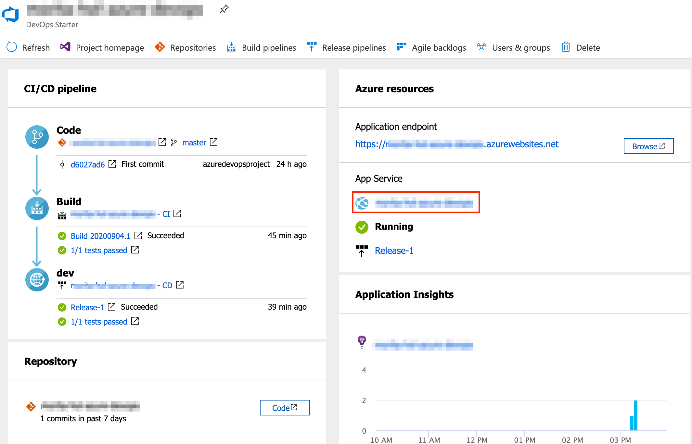
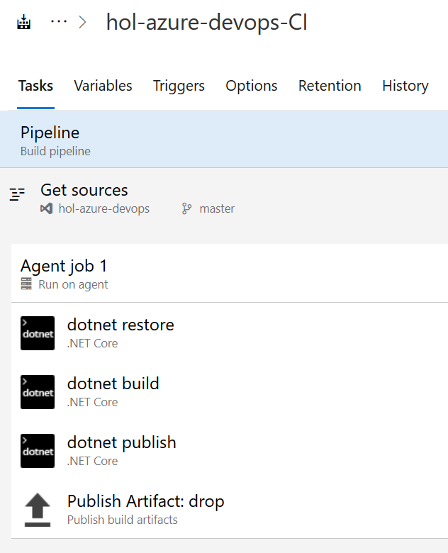

# Azure DevOps を使用したハンズオン
## 事前準備
下記のページを参考に Microsoft アカウントを作成すること。  
[新しい Microsoft アカウントを作成する方法](https://support.microsoft.com/ja-jp/help/4026324/microsoft-account-how-to-create)

## Azure DevOps とは
[Azure DevOps Services | Microsoft Azure](https://azure.microsoft.com/ja-jp/services/devops/)

## Azure DevOps アカウントの取得
[Azure DevOps Services | Microsoft Azure](https://azure.microsoft.com/ja-jp/services/devops/) にアクセスし「無料で始める」から Azure DevOps アカウントの取得する。  
  

Azure DevOps アカウントを取得すると自動的に組織（Organization）が作成される。

## プロジェクトの作成
下記の構成でプロジェクトを作成する。

- Project name : `hol-azure-devops`
- Visibility : Private
- Advanced
    - Version control : Git
    - Work item process : Basic

### 設定の確認
作成したプロジェクトの設定にて下記の機能が有効になっていることを確認する。

- Boards
- Repos
- Pipelines
- Artifacts
- Test plans

## Issue1 : ソースコードの準備
### チケットの作成
Boards のカンバンにアクセスし、下記の Issue を作成する。

- 列 : `To Do`
- タイトル : `Gitリポジトリをインポートする`
- アサイン : 自分

### 作業の開始
先ほど作成した Issue を Doing に動かす。  
Repos にアクセスし、下記の Github リポジトリをインポートする。  
https://github.com/alterbooth/hol-aspnetcore-sample.git

インポートに成功したら Issue を Done に動かすこと。

## Issue2 : パイプラインの作成
### チケットの作成
Boards のカンバンにアクセスし、下記の Issue を作成する。

- 列 : `To Do`
- タイトル : `ビルドパイプラインを作成する`
- アサイン : 自分

### 作業の開始
先ほど作成した Issue を Doing に動かす。  
Pipelines > Builds にアクセスし、 ASP.NET Core のビルドパイプラインを作成する。

1. [New pipeline] をクリックする
1. [Use the classic editor] をクリックする
1. インポートしたリポジトリをソースに指定する
1. テンプレートは選ばず [Empty job] をクリックする
1. [Agent job 1] に下記のタスクを追加する
    - `dotnet restore`
        - Path to project : `**/*.csproj`
    - `dotnet build`
        - Path to project : `**/*.csproj`
        - Arguments : `--configuration Release`
    - `dotnet publish`
        - Arguments : `--configuration Release --output $(build.artifactstagingdirectory) -r win-x64 --self-contained true`
    - Publish build artifacts
        - 設定変更不要
1. master ブランチへのプッシュをトリガーとする
    - [Triggers] > [Enable continuous integration]
1. パイプラインを保存する
    - [Save & queue] > [save]
1. [Queue] をクリックしパイプラインを手動実行する
1. ビルドパイプラインが成功したことを確認する

